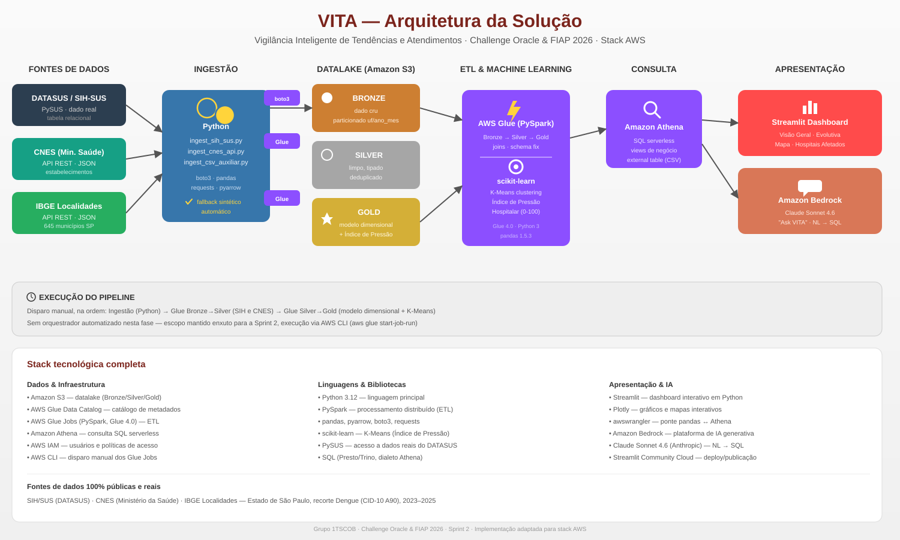

# VITA — Vigilância Inteligente de Tendências e Atendimentos

**Challenge Oracle × FIAP 2026 · Grupo 1TSCOB · Sprint 2**

Plataforma de monitoramento hospitalar que transforma dados públicos do SUS
em um painel inteligente de acesso hospitalar, com IA generativa integrada
para perguntas em linguagem natural. Implementação em **stack AWS**,
recorte analítico em **Dengue (CID-10 A90) — Estado de São Paulo — 2023 a 2025**.

<p align="center">
  
</p>

---

## 🔗 Acesso rápido

| O quê | Onde |
|---|---|
| **Dashboard ao vivo** | _adicione aqui o link do Streamlit Community Cloud após o deploy_ |
| Vídeo pitch | _adicione aqui o link do YouTube_ |
| Guia de setup do zero (sem saber AWS) | [`GUIA_PASSO_A_PASSO_DO_ZERO.md`](./GUIA_PASSO_A_PASSO_DO_ZERO.md) |
| Como conectar o dashboard | [`dashboard_streamlit/SETUP.md`](./dashboard_streamlit/SETUP.md) |

---

## 📌 O desafio

Secretarias de saúde e redes hospitalares precisam responder rapidamente a
perguntas críticas — quais regiões têm mais internações, onde a capacidade
hospitalar está no limite, quais doenças estão em alta — sem depender
exclusivamente de analistas SQL. O VITA usa dados 100% públicos e reais do
**DATASUS**, **CNES** e **IBGE** para automatizar essa vigilância, com um
índice de pressão hospitalar calculado via Machine Learning e um chatbot de
IA generativa que responde perguntas em português.

## 🏗️ Arquitetura (resumo)

```
Fontes (SIH/SUS, CNES, IBGE)
   → Ingestão (Python)
   → Datalake S3 — Bronze → Silver → Gold (AWS Glue / PySpark, execução manual)
   → Índice de Pressão Hospitalar (K-Means, scikit-learn)
   → Amazon Athena (SQL serverless)
   → Streamlit Dashboard + Amazon Bedrock (Claude — "Ask VITA")
```

Detalhes completos, com o papel de cada tecnologia, em
[`docs/architecture_diagram.md`](./docs/architecture_diagram.md).

## 📂 Estrutura do repositório

```
vita_challenge/
├── README.md                          ← este arquivo
├── GUIA_PASSO_A_PASSO_DO_ZERO.md       ← setup AWS do zero, para quem nunca usou
├── .gitignore
│
├── docs/
│   ├── architecture_diagram.md         ← arquitetura detalhada (Mermaid + tabelas)
│   └── images/
│       └── arquitetura_vita.svg        ← diagrama visual com ícones das tecnologias
│
├── infra/                              ← provisionamento da infraestrutura AWS
│   ├── setup_aws_infra.sh              ← cria buckets S3, IAM role, Glue databases
│   ├── criar_usuario_dashboard.sh      ← cria usuário IAM só-leitura p/ o dashboard público
│   ├── iam_*.json                      ← policies do IAM
│   └── glue_job_*.json                 ← definições dos Glue Jobs
│
├── ingestion/                          ← Fonte 1, 2 e 3 do desafio
│   ├── ingest_sih_sus.py               ← Fonte 1: SIH/SUS via PySUS (tabela relacional)
│   ├── ingest_cnes_api.py              ← Fonte 2: CNES via API (JSON)
│   ├── ingest_csv_auxiliar.py          ← Fonte 3: municípios via IBGE (CSV/external table)
│   └── requirements.txt
│
├── etl/                                ← AWS Glue Jobs (PySpark) — Bronze→Silver→Gold
│   ├── glue_bronze_to_silver_sih.py
│   ├── glue_bronze_to_silver_cnes.py
│   ├── glue_silver_to_gold_kpis.py     ← modelo dimensional + Índice de Pressão (ML)
│   └── ml_indice_pressao_hospitalar.py ← versão standalone p/ testar o modelo isolado
│
├── analytics/                          ← camada de consulta (Amazon Athena)
│   ├── athena_ddl.sql                  ← criação das tabelas externas
│   └── athena_gold_views.sql           ← views de negócio (o dashboard consome estas)
│
└── dashboard_streamlit/                ← dashboard principal (o que roda ao vivo)
    ├── app.py                          ← aplicação Streamlit completa (inclui o "Ask VITA")
    ├── requirements.txt
    └── SETUP.md                        ← como rodar local e publicar com link público
```

> Os jobs do Glue (`etl/`) são disparados manualmente, na ordem: `vita-bronze-to-silver-sih`
> e `vita-bronze-to-silver-cnes` → `vita-silver-to-gold`. Não há orquestração automatizada
> neste projeto — decisão consciente para manter o escopo enxuto na Sprint 2.

## 🧬 As 3 fontes de dados do desafio

| Fonte | Formato | Conteúdo | Script |
|---|---|---|---|
| 1 — SIH/SUS | Tabela relacional | Internações, valor pago, permanência, CID-10 | `ingestion/ingest_sih_sus.py` |
| 2 — CNES | JSON via API REST | Cadastro de hospitais, tipologia, localização | `ingestion/ingest_cnes_api.py` |
| 3 — Municípios | CSV / External Table | População, região, código IBGE (fonte: IBGE Localidades) | `ingestion/ingest_csv_auxiliar.py` |

Todas as três fontes têm **fallback sintético automático** — se a API/FTP de
origem estiver fora do ar no momento da ingestão, o pipeline gera uma amostra
sintética no mesmo schema, garantindo que a demonstração nunca trave.

## 🤖 Índice de Pressão Hospitalar (Machine Learning)

Calculado via **K-Means** (scikit-learn) sobre volume de internações,
permanência média e proporção de pacientes críticos, normalizado por
hospital/mês e classificado em 4 níveis de risco (Baixo → Sobrecarga
iminente). O modelo já roda dentro do job `etl/glue_silver_to_gold_kpis.py`
e os resultados estão na tabela `vita_gold.kpi_pressao_hospitalar`.

> ⚠️ **Status atual**: o índice está calculado e populado na camada Gold,
> mas **ainda não está exibido no dashboard** — as abas de mapa/ranking hoje
> mostram volume de casos de dengue (não o índice geral, que mistura todas
> as doenças). Incorporar essa visualização é um próximo passo planejado.
> Testes isolados do modelo em `etl/ml_indice_pressao_hospitalar.py`.

## 💬 Diferencial: "Ask VITA" (IA generativa)

Pergunta em português → Claude (Amazon Bedrock) gera o SQL → executa no
Athena → responde em linguagem natural. Equivalente funcional ao Oracle
Select AI mencionado no desafio original, embutido diretamente na aba
**Ask VITA** do dashboard.

## 🚀 Como rodar

Setup completo da infraestrutura AWS (ingestão → ETL → Athena):
ver [`GUIA_PASSO_A_PASSO_DO_ZERO.md`](./GUIA_PASSO_A_PASSO_DO_ZERO.md).

Só o dashboard (assumindo que a infraestrutura/dados já existem):
```bash
cd dashboard_streamlit
pip install -r requirements.txt
export AWS_REGION=us-east-1
export ATHENA_DATABASE=vita_gold
export ATHENA_WORKGROUP=primary
export BEDROCK_MODEL_ID=us.anthropic.claude-sonnet-4-6
streamlit run app.py
```

## 👥 Equipe — 1TSCOB

| Nome | RM | Função |
|---|---|---|
| Bianca Rodrigues Soares Costa | 570176 | Data Engineer |
| Larissa de Lima Silva (Representante) | 569577 | Data Analyst |
| Nicole Alexia Menezes de Abreu | 570696 | Product Owner |
| Paola Kaori Santos | 571433 | Product Owner |
| Rodrigo Felix Nakagawa | 570707 | Scrum Master |

## 📜 Licença e uso dos dados

Todas as fontes de dados são públicas: [DATASUS/SIH-SUS](https://datasus.saude.gov.br/),
[CNES](https://cnes.datasus.gov.br/) e [IBGE](https://www.ibge.gov.br/).
Projeto desenvolvido para fins acadêmicos no Challenge Oracle × FIAP 2026.
