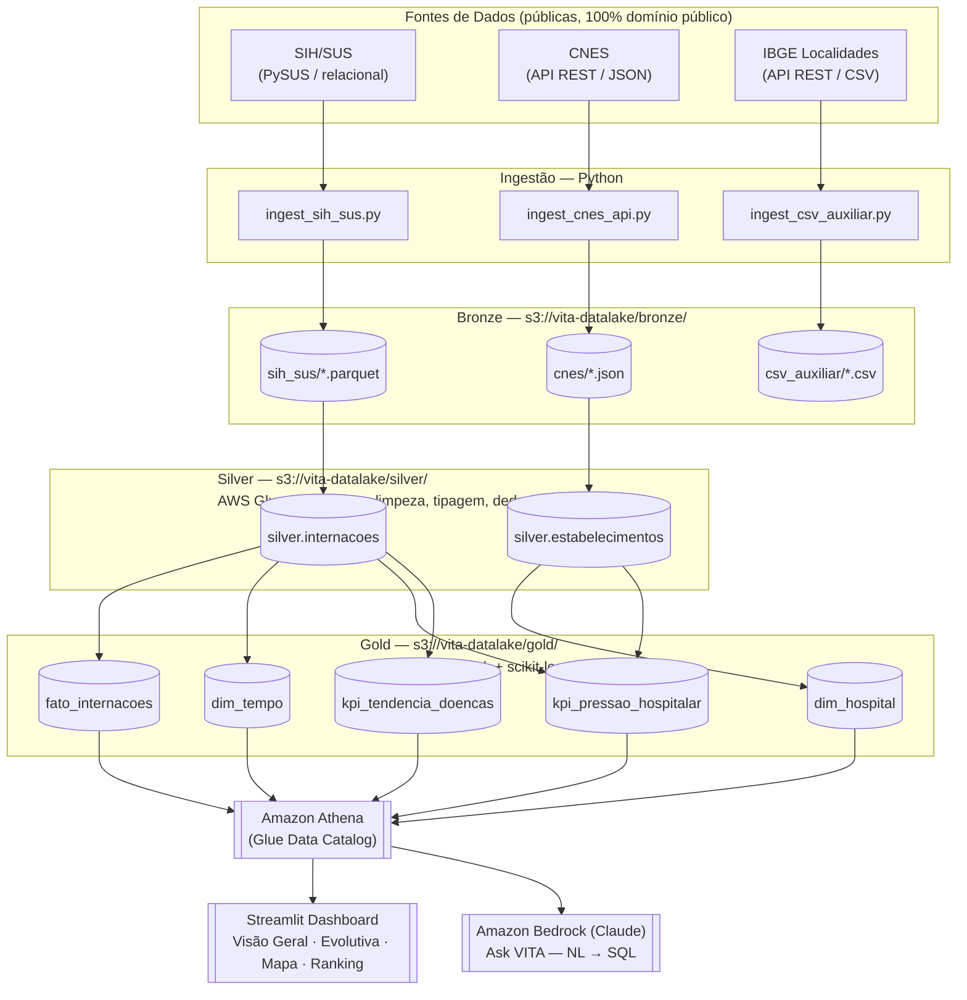

# Arquitetura da Solução VITA — AWS (Sprint 2)

> Diagrama visual (com ícones): [`docs/images/arquitetura_vita.svg`](./images/arquitetura_vita.svg)

## Diagrama (Mermaid — cole em https://mermaid.live para visualizar/exportar)



## Papel de cada tecnologia

| Componente | Tecnologia | Papel |
|---|---|---|
| Ingestão | Python (PySUS, requests, boto3) | Extrai as 3 fontes e grava cru no Bronze. Execução manual/local — sem orquestração automatizada nesta fase do projeto |
| Datalake | Amazon S3 (Bronze/Silver/Gold) | Armazenamento particionado por camada |
| Catálogo | AWS Glue Data Catalog | Schema centralizado, usado por Athena e pelos Glue Jobs |
| ETL | AWS Glue (PySpark) | Limpeza, joins, modelagem dimensional, KPIs — disparado manualmente via `aws glue start-job-run` |
| ML | scikit-learn (K-Means), dentro do Glue Job Gold | Índice de Pressão Hospitalar (calculado, ainda não exibido no dashboard) |
| Consulta | Amazon Athena | SQL serverless sobre o S3, sem banco ligado 24/7 |
| Visualização | Streamlit (Python) | Dashboard interativo — KPIs, evolução temporal, mapa, ranking |
| IA generativa | Amazon Bedrock (Claude Sonnet 4.6) | "Ask VITA" — pergunta em português vira SQL e resposta, embutido no próprio dashboard |

## Ordem de execução do pipeline (manual)

```
1. ingestion/ingest_sih_sus.py       → bronze/sih_sus/
2. ingestion/ingest_cnes_api.py      → bronze/cnes/
3. ingestion/ingest_csv_auxiliar.py  → bronze/csv_auxiliar/
4. aws glue start-job-run --job-name vita-bronze-to-silver-sih
5. aws glue start-job-run --job-name vita-bronze-to-silver-cnes
   (espera os dois acima terminarem com SUCCEEDED)
6. aws glue start-job-run --job-name vita-silver-to-gold
7. No Athena: athena_ddl.sql, depois athena_gold_views.sql
8. Dashboard Streamlit consome as views direto do Athena
```

## Modelo dimensional da camada Gold

```
fato_internacoes
 ├── cnes_id (FK → dim_hospital)
 ├── municipio_id
 ├── ano, mes, semana_epidemiologica
 ├── cid_principal
 ├── valor_total
 └── dias_permanencia

dim_hospital
 ├── cnes_id (PK)
 ├── nome_estabelecimento
 ├── codigo_tipo_unidade, eh_tipo_hospitalar
 ├── uf, codigo_municipio
 ├── latitude, longitude
 └── leitos_totais, leitos_sus (indisponíveis na fonte atual, nulos)

dim_tempo
 ├── ano, mes, semana_epidemiologica
 └── trimestre

kpi_pressao_hospitalar        (granularidade: hospital x mês — todas as doenças)
 ├── cnes_id, ano, mes
 ├── qtd_internacoes, permanencia_media, pacientes_criticos
 ├── cluster, nivel_risco
 └── indice_pressao (0-100)

kpi_tendencia_doencas          (granularidade: uf x doença x semana)
 ├── uf, cid_principal, ano, mes, semana_epidemiologica
 ├── qtd_casos
 └── variacao_pct
```

## Recorte analítico do dashboard

O dashboard filtra especificamente **Dengue clássica (CID-10 A90) — SP —
2023 a 2025**, definido em `dashboard_streamlit/app.py` (`CIDS_DENGUE`,
`UF_FILTRO`, `ANO_INICIO_FILTRO`/`ANO_FIM_FILTRO`). O Índice de Pressão
Hospitalar (`kpi_pressao_hospitalar`) não é usado nas abas atuais por
misturar todas as doenças — as abas de mapa e ranking usam contagem direta
de casos de dengue em vez do índice.
